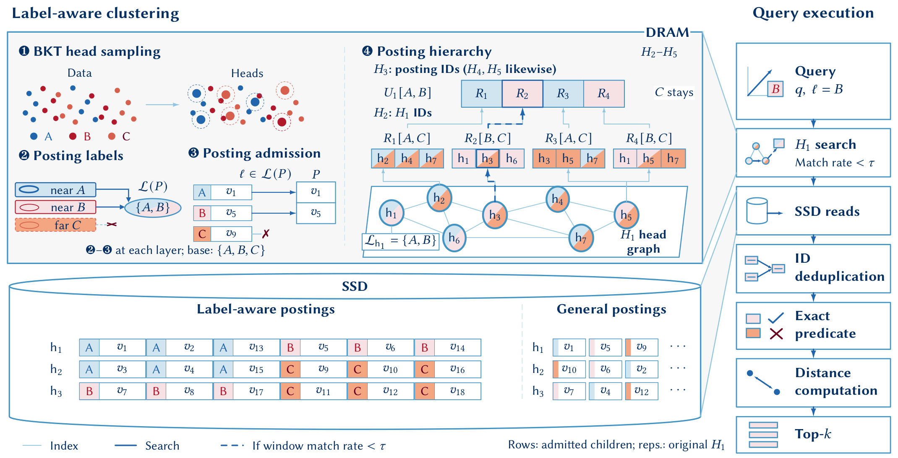

# LION

**Label-aware Inverted Organization for Neighbor search**

[](LICENSE)
[Getting started](docs/GettingStart.md) |
[Native configuration](docs/AdaptiveSpann.ini) |
[Benchmark guide](Tools/benchmarks/README.md)

LION is a key-attribute-aware architecture for **disk-resident filtered
approximate nearest neighbor search**. It combines spatially organized,
label-aware postings on SSD with an in-memory posting hierarchy and
matching-rate-driven **Adaptive Expansion**. General postings retain an access
path for unfiltered queries and predicates outside the designated key attribute.

The goal is to address two different costs: reading pages with too few eligible
records, and spending too much search effort finding heads that can supply those
records. Candidate discovery is approximate; **the complete predicate is checked
exactly before a record can become a result**.

## Architecture

[](docs/img/lion-architecture.png)

*Label-aware clustering, the posting hierarchy, and query execution, adapted
from the LION manuscript's architecture figure. Click the image for the
full-resolution diagram.*

| Mechanism | Role |
| --- | --- |
| **Label-aware clustering** | Group nearby records into postings for selected key labels, retaining spatial locality while reducing label mixing within an SSD read. |
| **Posting hierarchy** | Organize additional routes to label-supporting heads where estimated local candidate capacity is insufficient. |
| **Adaptive Expansion** | Monitor matching yield during native head search and, when triggered, explore the hierarchy through one shared, budgeted frontier. |

### Label-aware clustering

Label-aware clustering combines spatial head selection, posting-label selection
and label-compatible record assignment to construct label-aware postings.
General postings retain a label-independent access path.

Both layouts share the same H1 head identities, vectors, BKT and navigation
graph. For each head, its label-aware **H region** and general **O region**
occupy separately addressable parts of the SSD posting container. These H/O
regions are distinct from the hierarchy levels H1 through H5.

Head labels come from the head's own key label and nearby records retained by
general posting placement. Support expansion can add labels with too few
supporting heads, beyond the initial per-head selection.
Records enter only compatible label-aware postings, with native
relative-neighborhood (RNG) pruning and a replica upper bound.

The general region keeps vector-oriented placement without the key-label
constraint. Keeping both layouts costs additional payload storage, but does not
require another base navigation graph or an ANN graph for every label.

### Posting hierarchy and local admission

H2 through H5 are **in-memory posting catalogs, not additional online ANN
graphs**. H2 rows contain H1 IDs; every higher layer references only the
immediately lower layer. Per-label rows and reverse-owner links support shared
upward and downward exploration. Representatives refer to original H1 vectors.

During label-aware clustering, local admission decides whether a child-label
pair continues upward using:

```text
estimated supporting heads = local H1-support fraction * effective window
continue upward only when estimated supporting heads < construction target
```

The effective window expands by the inverse sampling ratio at each transition.
Statistics count distinct H1 heads rather than replicated posting references.
The same label can stop at different levels in different regions; a stopped
child-label pair cannot skip a level and restart above it. This is a build-time
capacity estimate, not global label frequency or a query-time recall guarantee.

The native upper-only builder reconstructs these catalogs into a new directory
while preserving the source H1 and SSD payload. Temporary assignment graphs are
used during label-aware clustering and are not persisted as query navigation
structures.

### Query processing

1. **Select the posting layout.** Use label-aware postings when every OR branch
   requires equality on the designated categorical key; otherwise use general
   postings. Other categorical and numeric conditions remain part of the exact
   predicate.
2. **Search native H1 first.** Nonmatching heads can remain navigation bridges.
   With match-rate expansion enabled, complete windows of newly scored
   candidates measure predicate-compatible head support, not final-record
   selectivity.
3. **Expand when triggered and covered.** A low-yield window triggers hierarchy
   supplementation. Early handoff is allowed only when the upper postings cover
   all requested key labels; partial-coverage OR queries finish native H1 first.
   Expansion reuses scored candidates and cached distances. All OR labels share
   one frontier and visited state, and discovered heads compete with native
   results in a bounded `nprobe` heap.
4. **Read and verify.** Selected heads identify the chosen SSD regions. Native
   ID/liveness handling, deduplication and exact predicate checks precede fresh
   record scoring and final top-k selection.

Expansion is bounded by native work allowances and representative-distance
convergence; representative distance is an ANN heuristic, not a certified
lower bound on member distances. Disabling the match-rate policy retains the
documented completion-first behavior. See
[search-budget semantics](docs/SearchBudgetBoundaries.md) for the distinction
between online soft stopping and offline construction bounds.

## Build

The native Linux path requires a C++17 compiler with OpenMP, CMake,
Boost >= 1.67, TBB, NUMA and Linux AIO development libraries. The wrapper
configuration also uses SWIG and Python development headers. SPDK, RocksDB and
GPU support are not required for this path.

From the root of your local source checkout, initialize the pinned compression
dependency and build the native tools. These commands do not download datasets.

```bash
git submodule update --init -- ThirdParty/zstd

cmake -S . -B build -DCMAKE_BUILD_TYPE=Release \
  -DSPDK=OFF -DROCKSDB=OFF -DGPU=OFF
cmake --build build --parallel 8 \
  --target spannbuilder rebuildsparselabelhierarchy nativeBench
```

Binaries are written to `Release/`. The repository and native executable/API
names retain their existing SPTAG/SPANN identifiers for compatibility; **LION**
names the filtered-search architecture described here.

## Getting started

Use native INI files as the source of truth for input paths, schema,
construction and query settings. Start with
[`docs/AdaptiveSpann.ini`](docs/AdaptiveSpann.ini), replace every
`/absolute/path/to/...` value and provide row-aligned vectors and attributes.
Categorical/numeric column order is explicit; the key is an original categorical
column index. The current input schema uses one scalar value per column, not
arbitrary variable-length label sets.

After preparing your dataset-specific INI:

```bash
python3 Tools/benchmarks/validate_spann_hierarchy_config.py /absolute/path/to/dataset.ini
bash Tools/benchmarks/run_spann_attr_build.sh /absolute/path/to/dataset.ini
```

To derive the locally admitted posting hierarchy from a canonical five-level source,
use [`docs/LocalLabelHierarchy.ini`](docs/LocalLabelHierarchy.ini) and the
[upper-only reconstruction instructions](docs/GettingStart.md#rebuild-only-local-label-postings).
Use a fresh destination and preserve the source index: derived snapshots refer
to its immutable H1 and SSD files.
For opt-in, bounded O/H sampling that sizes upper centers toward a target
single-label posting mean, see [sampled hierarchy sizing](docs/SampledHierarchySizing.md).
This preserves local admission and writes a new V6 snapshot.

The current templates use `HierarchyLocalTarget=512`,
`HierarchyLocalWindow=4096` and a 15% observed-match trigger with a 1024-candidate
window. These are **starting configurations, not a universal optimum**.
Construction admission and query expansion are separate controls. Evaluate
recall, latency, storage and build cost for the actual dataset and predicate
workload; historical measurements do not establish performance for a new index.

| Documentation | Contents |
| --- | --- |
| [Getting started](docs/GettingStart.md) | Native inputs, attribute/groundtruth preparation, building, reconstruction and search settings. |
| [Native INI template](docs/AdaptiveSpann.ini) | Dataset-independent construction and query configuration. |
| [Posting hierarchy recipe](docs/LocalLabelHierarchy.ini) | Upper-only reconstruction without rebuilding H1/SSD. |
| [Benchmark guide](Tools/benchmarks/README.md) | Native benchmark clients, predicate inputs and experiment provenance. |
| [Search-budget boundaries](docs/SearchBudgetBoundaries.md) | Online stopping, supplementary work and bounded construction semantics. |

## References

- **LION: A Key-Attribute-Aware Architecture for Filtered Approximate Nearest
  Neighbor Search.** The LION research manuscript supplies the design and
  architecture illustration summarized in this README.
- **SPTAG: A library for fast approximate nearest neighbor search.**
  [Original Microsoft repository](https://github.com/microsoft/SPTAG).
  LION is implemented in this SPTAG-derived codebase and retains its native
  BKT/SPANN foundation. Upstream documentation and research belong to the
  original project, not to LION-specific contributions.
- **SPANN: Highly-efficient Billion-scale Approximate Nearest Neighborhood
  Search.** Qi Chen et al., NeurIPS 2021.
  [Paper](https://proceedings.neurips.cc/paper_files/paper/2021/file/299dc35e747eb77177d9cea10a802da2-Paper.pdf).
  SPANN provides the memory-head / SSD-posting foundation.

## License

This repository is distributed under the [MIT license](LICENSE). Existing
Microsoft copyright and third-party license notices are preserved.
